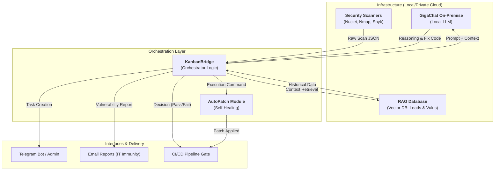

# Архитектура интеграции локальной LLM (GigaChat) в VulnDetector

## 1. Концептуальная схема (Mermaid)

## 2. Детальное описание компонентов

### 🔐 Sber GigaChat On-Premise (Local LLM)
Ядро системы. Используется для:
-   **Анализа сырых логов**: Преобразование тысяч строк вывода сканеров в понятную бизнес-логику.
-   **Генерации патчей**: Написание SQL-инъекционных фильтров, конфигураций Nginx или обновлений Dockerfile.
-   **Классификации**: Автоматическое определение приоритета (Critical, High, Medium) на основе корпоративных стандартов.

### 🧠 RAG (Retrieval-Augmented Generation)
Система использует 2,000+ исторических отчетов (лидов), собранных за 2 года:
-   **Векторный поиск**: Когда находится новая уязвимость, RAG ищет, встречалась ли она раньше и как была решена.
-   **Persistence**: Все новые сканы дообучают систему в режиме реального времени.

### ⚙️ KanbanBridge (Orchestrator)
"Мозг", написанный на Python, который:
-   Слушает Telegram и Почту.
-   Управляет очередями задач в Kanboard.
-   Оркестрирует вызовы GigaChat API (через внутренний прокси).

### 🛠 AutoPatch Module
Модуль "IT-Иммунитета", который получает от LLM готовый код исправления и применяет его в тестовой среде (Staging) перед подтверждением администратором.

## 3. Почему это важно для Sber500?
1.  **Конфиденциальность**: Данные не покидают периметр компании (GigaChat On-Prem).
2.  **Масштабируемость**: Один ИИ-агент заменяет команду из 3-5 AppSec инженеров.
3.  **Скорость**: Время от обнаружения до патча сокращается с дней до минут.
